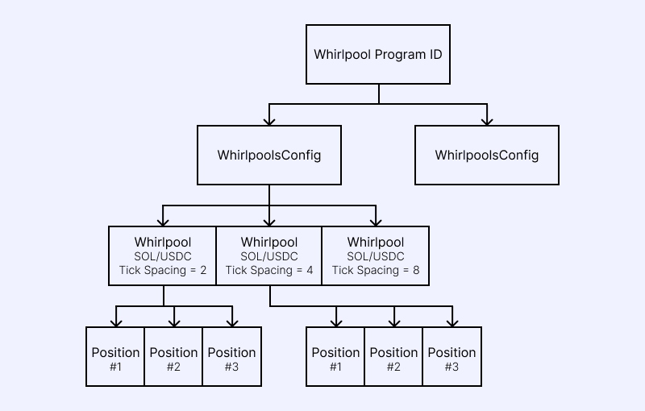
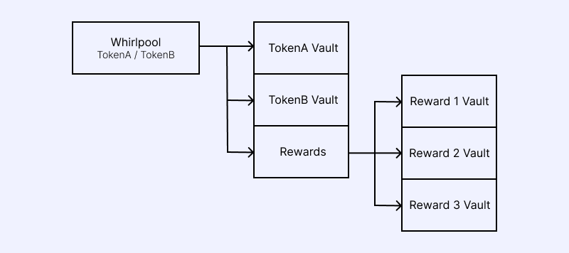

# 계정 구조

## 개요

## WhirlpoolsConfig

WhirlpoolsConfig 계정에는 선택적으로 WhirlpoolsConfigExtension 계정을 연결할 수 있습니다.
이 확장 계정은 TokenExtensios, 특히 TokenBadge 계정 관리를 위한 추가 권한을 갖습니다.

## FeeTier

FeeTier 계정은 WhirlpoolsConfig 및 틱 간격(tick spacing)별로 적용될 수수료율을 정의합ㄴ디ㅏ.

## Whirlpool

Whirlpool은 두 토큰(A & B) 쌍 간의 집중 유동성 풀(Concentrated Liquidity Pool)입니다.

각 Whirlpool 계정은 풀 계정을 처리하는데 필요한 정보와 해당 풀의 금고(Vault)에 연결된 토큰 계정들을 보관합니다.
금고에서 인출할 권한은 오직 Whirlpool 프로그램에만 있으며, 프로그램 소유자나 WhirlpoolsConfig의 소유자도 금고에서 자금을 인출할 수 없습니다.

Whirlpool 계정은 Config, 토큰 페어 민트(Token pair mints), 틱 간격을 기준으로 해시되어 생성되기 때문에, 동일한 토큰 쌍이라도 틱 간격이 다른 여러 풀이 존재할 수 있습니다.

사용자는 이 Whirlpool을 대상으로 포지션 관리 및 수수료, 보상 수집 작업을 수행할 수 있습니다.

## TickArray (틱 배열)

틱 배열에 대한 설명은 "Understanding Tick Arrays" 문서를 참고하세요.

## Position (포지션)

포지션은 하나의 Whirlpool 내에서 특정 가격 범위에 분포된 유동성 집합을 나타냅니다. 자세한 내용은 "Tokenized Positions" 문서를 확인하세요.

## Position Bundle (포지션 번들)

포지션 번들을 생성하면 최대 256개의 포지션을 하나의 NFT로 묶어 관리할 수 있습니다.

포지션을 닫을 때 동일한 포지션 번들(PositionBundle) 계정에서 새 포지션을 생성하므로, 리밸런싱 과정에서 계정 임대(Rent, 렌트) 비용이 추가로 발생하지 않습니다.

많은 포지션을 자주 열고 닫아야 하는 경우, 포지션 번들(PositionBundle) 사용을 강력히 권장합니다.

## TokenBadge (토큰 뱃지)

TokenExtensions을 지원하기 위해 도입된 계정입니다.

TokenExtensions은 유용한 기능을 제공하지만, 일부 확장 기능은 풀 또는 사용자에게 위험을 초래할 수 있습니다.

따라서 특정 확장 기능이 적용된 토큰은 TokenBadge 권한이 해당 토큰에 대해 TokenBadge를 발급한 경우에만 풀 초기화를 진행할 수 있습니다.

## Whirlpool의 계정 저장 방식

Whirlpool 프로그램의 모든 계정은 상위 계정들로부터 파생된 프로그램 유도 주소(Program Derived Address, PDA)로 저장됩니다.