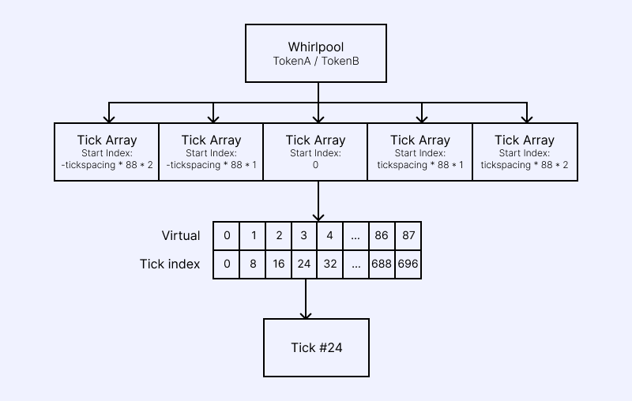
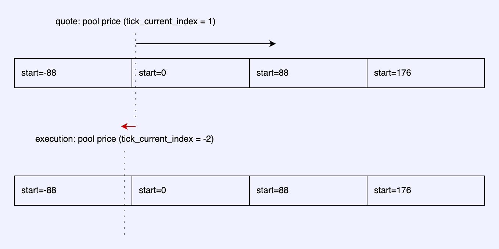
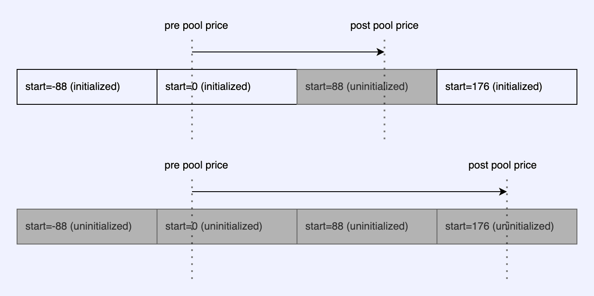

# 틱 배열의 이해

블록체인에는 개별 틱 배열(tick-array) 계정마다 틱의 배열이 저장됩니다. 각 Whirlpool은 전체 틱 범위를 제공하기 위해 tick-array 계정들의 배열을 갖고 있습니다.

tick-array 계정은 제공하는 틱의 시작 인덱스(start-index)로 구분됩니다. 초기화 가능한 틱 인덱스만 보관하므로, 전체 범위는 `88 * tick-spacing` 입니다.

**틱 배열(tick-array) 개요**
* 키(key) : tick-array 계정은 제공하는 틱의 시작 인덱스(start-index)로 구분됩니다.
* 하나의 틱 배열이 갖고 있는 틱의 수 : 88개

## Whirlpool 프로그램 명령어

Whirlpool의 명령을 수행할 때 특정 틱 객체에 접근하려면 올바른 tick-array 계정을 파생(derive)해야 합니다.
이때 tick-array 계정은 Whirlpool 풀의 퍼블릭 키와 해당 배열의 시작 틱 인덱스를 사용해 PDA(Program Derived Address)로 생성됩니다.
예를 들어, 현재 틱이 200이고 틱 간격(tick-spacing)이 2, 틱 배열 당 88개의 틱을 갖고 있다고 가정해보면 시작 인덱스는 `(200 // (2 * 88))  * (2 * 88) = 176`입니다.

### 포지션 열기(Open Position)

새 틱 또는 가격 범위에 포지션을 생성하려면, 해당 tick-array를 먼저 초기화해야 합니다.
초기화 명령을 호출하는 사용자는 10KB 크기의 계정 렌트 면제(rent-exempt) 비용을 부담해야 합니다.

한 번 초기화된 tick-array 계정은 닫을 수 없으며, 추후에 다시 초기화할 필요가 없습니다.
따라서 Whirlpool 소유자는 사용자에게 갑작스러운 비용이 발생하지 않도록 미리 tick-array 범위를 초기화해 둘 수 있습니다.

### 유동성 조정(Adjust Liquidity)

`increase_liquidity` 또는 `decrease_liquidity` 명령 시, 저장된 틱 인덱스를 포함하는 두 개의 tick-array 계정을 반드시 전달해야 합니다.
범위가 좁으면 동일한 배열을 두 번 전달해도 무방합니다. 이 계정들에서 틱 객체를 읽어 유동성을 조정합니다.

### 스왑 (Swap)

스왑 명령 시, 스왑이 통과할 일련의 tick-array 계정들을 지정해야 합니다.

첫 번째 배열에는 일반적으로 현재 틱을 포함하는 배열을 넣지만, 필수는 아닙니다. 이어서 스왑 방향으로 두 개의 배열을 지정합니다.
만약 스왑이 다음 배열로 넘어가지 않을 것이 명확하거나 가격 범위 양쪽 끝인 경우, 아무 배열 키를 넣어도 됩니다.

**swapV2에서 추가 배열 제공**
`swapV2` 명령의 `remaining_accounts` 필드에 최대 세 개의 배열을 추가로 전달할 수 있어, 총 6개 배열까지 제출 가능합니다.
이 기능은 현재 틱이 배열 가장자리 근처일 때 유용합니다. 트랜잭션이 실행될 때 가격이 배열 범위를 넘어가면 오류가 발생할 수 있는데, 
이때 시작 인덱스가 -88인 tick-array를 추가로 넣어 오류를 방지할 수 있습니다.

TypeScript SDK(@orca-so/whirlpool)이나, Rust SDK(orca_whirlpools)을 사용하면 이 과정이 자동으로 처리됩니다.

> 주의: 최대 6개의 배열을 제출할 수 있지만, 실제 스왑 처리에는 최대 3개 배열만 사용됩니다.
> 세 번째 배열을 넘어 이동하면 오류가 발생하며 스왑은 실패합니다.

**SparseSwap(희소 스왑) : 스왑 도중 초기화되지 않은 틱을 건너뛰기**

`swap` 및 `swapV2` 명령 모두에 대해, 모든 틱 배열 계정이 초기화될 필요는 없습니다.
Whirlpool 상태에 정의된 현재 틱 위치에 활성 유동성이 충분히 존재하는 한, Whirlpool 프로그램은 스왑을 실행할 수 있습니다. 아래 다이어그램을 참조하세요.

**SparseSwap(희소 스왑) : 견적 생성**

Orca SDK는 초기화되지 않은 틱 배열의 가능성을 고려하여 스왑 견적을 생성할 수 있습니다. 공식 SDK 중 하나를 사용하는 것을 강력하게 권장합니다.
* TS Whirlpools SDK
* Rust Whirlpools SDK
* TS Legacy SDK (버전 > 0.13.4)

커스텀 통합을 구축하는 경우, 이 기능을 반드시 염두하세요. 견적을 생성하려면 틱 배열 계정을 가져와서 틱을 파싱하여 스왑 중 발생할 수 있는 유동성 변화를 미리 인지해야 합니다.

만약 초기화되지 않은 틱 배열을 만나면, 잔여 유동성이 없다고 잘못 가정하여 사용자에게 스왑이 불가능하다고 잘못 알릴 수 있습니다.
이를 방지하려면 SDK 내부의 견적 생성 로직, 특히 다음 함수들을 검토하세요.
* `fetch_tick_arrays_or_default`
* `swap_quote_by_input_token` 및 `swap_quote_by_output_token`
* `compute_swap`
* `compute_swap_step`