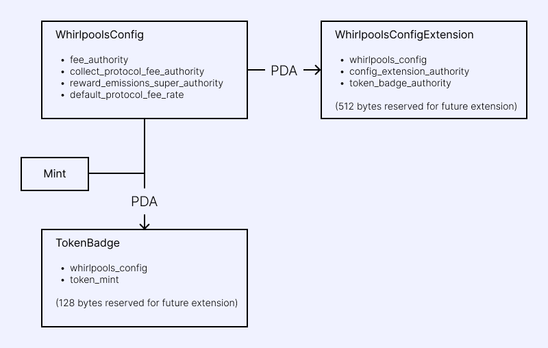

# 토큰 확장(TokenExtensions)

2024년 5월 28일, Whirlpool 프로그램이 TokenExtensions(Token-2022 프로그램)을 지원하도록 업그레이드됐습니다.

## 확장 목록(Extension List)

**지원 목록**
* TransferFee
* InterestBearing (2024년 10월 11일부터 지원)
* MemoTransfer
* MetadataPointer
* TokenMetadata
* ConfidentialTransfer (Non-confidential 전송에만 적용)

**초기화된 토큰뱃지(TokenBadge)가 있는 경우에만 지원**
* PermanentDelegate
* TransferHook
* MintCloseAuthority
* DefaultAccountState (기본 상태가 초기화 돼있어야함)

> ℹ️FreezeAuthority는 확장 기능은 아니지만 토큰 뱃지(TokenBadge)가 필요합니다.
> 합리적인 이유(예: 법적 준수)가 없는 한 비활성화돼야 합니다. FreezeAuthority 거부는 TokenProgram 토큰에는 적용되지 않지만, TokenExtensions 토큰에는 적용됩니다.

**지원되지 않음**
* Group, GroupPointer
* Member, MemberPointer
* NonTransferable
* All other extensions not listed above

## 새로운 명령어들

### V2 명령어

V2 명령어는 Token-2022 프로그램이 소유한 토큰을 처리할 수 있도록 지원합니다.

* V1 명령어는 Token-2022 토큰으로 구성된 풀에 사용할 수 없습니다.
* V2 명령어는 다음 조합의 풀에서 동작합니다. V2는 V1을 포괄합니다. 항상 V2만 사용하는 구현은 간단하지만, ALT를 사용하지 않으면 더 많은 계정을 필요로 해 트랜잭션 크기가 커질 수 있습니다.
  * Token / Token
  * Token-2022 / Token
  * Token / Token-2022
  * Token-2022 / Token-2022
* Token-2022 프로그램은 전송을 위해 Mint 계정을 필요로 하므로, V2 명령어는 토큰 프로그램과 Mint 계정을 같이 전달받아야 합니다. 또한 MemoTransfer를 지원하기 위해 SPL Memo 프로그램도 전달받아야 합니다.
* TransferHook 확장 기능이 적용된 토큰을 다룰 때, 명령어는 해당 Hook 프로그램에서 사용하는 계정들을 `remaining_accounts`로 전달받습니다.
* 전송 수수료를 줄이기 위해 `two_hop_swap-v2`는 사용자의 토큰 계정을 거치지 않고 첫 번째 풀에서 두 번째 풀로 토큰을 직접 전송합니다.

**거래 관련**

| 명령 | V1 | 노트                           |
| --- | --- |------------------------------|
| swap_v2 | swap |                              |
| two_hop_swap_v2 | two_hop_swap | 전송 수수료를 줄이기 위해 중간 토큰 계정이 제거됨 |

**유동성 관련**

| 명령                    | V1                 |
|-----------------------|--------------------|
| increase_liquidity_v2 | increase_liquidity |
| decrease_liquidity_v2 | decrease_liquidity |

**수수료와 보상 관련**

| 명령                       | V1                    |
|--------------------------|-----------------------|
| collect_fees_v2          | collect_fees          |
| collect_reward_v2        | collect_reward        |
| collect_protocol_fees_v2 | collect_protocol_fees |
| set_reward_emissions_v2  | set_reward_emissions  |

**풀 관련**

| 명령                   | V1                |
|----------------------|-------------------|
| initialize_pool_v2   | initialize_pool   |
| initialize_reward_v2 | initialize_reward |

## ConfigExtension & TokenBadge 명령어
* initialize_config_extension
* set_config_extension_authoirty
* set_token_badge_authority
* initialize_token_badge
* delete_token_badge

## 토큰 뱃지(Token Badge)

토큰에 PermanentDelegate와 같은 특정 확장이 적용된 경우 무제한으로 풀을 생성할 수 있게 허용하는 것은 이점보다 위험이 더 큽니다.
이러한 유형의 토큰을 안전하게 지원하기 위해 TokenBadge가 화이트리스트 매커니즘으로 도입되었습니다.

토큰 뱃지는 PDA로, 해당 토큰에 대해 풀과 보상을 초기화할 수 있도록 합니다. 각 Whirlpool 구성은 TokenBadge 계정을 사용하여 독립적으로 토큰을 화이트리스트에 추가할 수 있습니다.

TokenBadge 자체는 초기화 시 사용된 WhirlpoolsConfig와 Mint만 기록하며, 추가 정보는 포함하지 않습니다. TokenBadge의 존재는 해당 토큰에 대해서 풀과 보상을 초기화할 수 있음을 의미합니다.

## 그 외

### 동결 권한 (Freeze Authority)

Token-2022 토큰 중 Freeze Authority가 설정된 토큰은 TokenBadge 계정이 초기화되지 않은 한 거부됩니다.

풀을 Token-2022 토큰으로 초기화할 경우, 반드시 FreezeAuthority를 비활성화했는지 확인하세요.

### 네이티브 토큰 (WSOL)

Token-2022 프로그램은 자체적인 Wrapped SOL 민트 주소(9pan9bMn5HatX4EJdBwg9VgCa7Uz5HL8N1m5D3NdXejP)를 갖고 있습니다. 이를 WSOL-2022라고 부릅시다.
Whirlpool 프로그램은 WSOL-2022를 지원하지 않습니다.

WSOL-2022에는 토큰 확장 기능이 없으므로, 기존의 WSOL(So11111111111111111111111111111111111111112)을 사용하세요.

### 전송 수수료 (TransferFee)

`TransferFeeConfig` 확장이 적용된 Token-2022 토큰을 사용하여 누구나 Whirlpool을 초기화할 수 있습니다.

**`amount`와 `otherAmountThreshold`**

각 컨텍스트에서의 `amount`와 `otherAmountThreshold`, `TransferFee`의 상관 관계는 아래와 같습니다.

ExactIn (`amount_specified_is_input = true`)
* `amount` : 전송 수수료가 포함된 금액(사용자의 토큰 계정에서 전송될 금액)
* `otherAmountThreshold` : 전송 수수료가 제외된 금액(사용자의 토큰 계정으로 수신될 금액)

ExactOut (`amount_specified_is_input = false`)
* `amount` : 전송 수수료가 제외된 금액(사용자의 토큰 계정으로 수신될 금액)
* `otherAmountThreshold` : 전송 수수료가 포함된 금액(사용자의 토큰 계정에서 전송될 금액)

사용자는 수수료와 관계없이 토큰 계정에서 나가는 정확한 금액(amount)과 들어오는 정확한 금액(otherAmountThreshold)에 대한 조건을 설정할 수 있습니다.

수수료 양을 제한하는 추가 매개변수는 없습니다. 수수료가 변경될 경우 갑작스러운 인상을 방지하기 위해 새로운 수수료율은 두 개의 에포크 뒤에 적용됩니다.
트랜잭션 유효 기간 내에 수수료 변경이 발효될 예정인 예외적인 경우에는, 나가는 금액 및 들어오는 금액 임계값을 초과하는 트랜잭션이 실패합니다.

**`minA/B`, `maxA/B`**
* 유동성 추가(Increase Liquidity): `maxA`, `maxB` - 전송 수수료가 포함된 금액 (사용자의 토근 계정에서 전송됨)
* 유동성 제거(Decrease Liquidity): `minA`, `minB` - 전송 수수료가 제외된 금액 (사용자의 토큰 계정으로 수신됨)

### 전송 훅 (TransferHook)

TransferHook을 사용하려면 WhirlpoolsConfig 소유자가 해당 토큰에 대해 토큰 뱃지(TokenBadge)를 발급해야 합니다.

**remaining_accounts 사용**

TransferHook에서 사용하는 프로그램마다 사용되는 계정이 다릅니다. 따라서 이들은 remaining_accounts를 통해 전달됩니다.

remaining_accounts로 전달된 계정들의 문맥을 명확히 하기 위해, V2 인스트럭션은 remaining_accounts_info라는 데이터를 함께 받습니다. 이 데이터는 remaining_accounts에 포함된 계정들을 분류하는 데 사용됩니다.
예를 들어, 처음 3개는 mintA의 TransferHook용, 다음 2개는 mintB의 TransferHook용 식으로 구분합니다.

**보안 노트**

* 솔라나에서 간접적인 재진입(indirect re-entrance)은 거부됩니다. 따라서 TransferHook 프로그램은 Whirlpool 프로그램을 호출할 수 없습니다.
* TransferHook 프로그램은 전송 금액을 수정할 수 없습니다. 해당 프로그램은 토큰 전송 처리 후에 실행됩니다.
* Token-2022 프로그램은 TransferHook 프로그램을 호출할 때, 소스(source), 목적지(destination), 소유자(owner) 계정이 추가 계정으로 전달되더라도 해당 계정들의 signer 및 writable 플래그를 제거합니다. 이로 인해 소스와 목적지 계정은 업데이트되지 않으며, 소유자의 서명이 의도치 않게 사용되지 않습니다.

**토큰 뱃지 요청**

TransferHook 확장 기능은 에코시스템 내에서 비교적 새로운 기능이며, 아직 실험 단계입니다.

어떤 유형의 TransferHook 토큰이 TokenBadge 대상이 될지는 아직 결정되지 않았지만, 다음 모범 사례가 선택 지침이 될 것입니다:

* TransferHook 프로그램의 코드는 공개되어 있습니다. 코드와 프로그램이 일치함을 보장하기 위해 Verifiable Build가 수행되었습니다.
* 업그레이드 권한은 비활성화되어야 합니다(이상적이지만 필수는 아닙니다). 사용자에게 위험을 주지 않는 처리만 수행해야 합니다(예: 로깅).
* TransferHook은 토큰 전송을 차단해서는 안 되며, 차단 기준이 명확히 선언되고 공정하며 합당해야 합니다.
* TransferHook은 풀의 작동을 방해해서는 안 되며, 거래, 예치, 인출, 수확 작업에 간섭해서는 안 됩니다.
* 전송될 토큰 수량을 기준으로 트랜잭션을 차단하는 확장은 풀 사용자에게 예기치 않은 실패를 초래하므로 바람직하지 않습니다. 반면, 공적 기준에 따라 제재 대상 지갑으로의 전송을 실패 처리하는 것은 대부분의 사용자가 풀을 사용하는 데 지장을 주지 않습니다.
* TransferHook은 트랜잭션 크기를 증가시키는 많은 수의 계정을 요청해서는 안 됩니다.
* TransferHook은 어떠한 토큰 전송(WSOL 및 네이티브 SOL 포함)도 시도해서는 안 됩니다.
* TransferHook은 추가 수수료를 부과하려 해서는 안 됩니다.