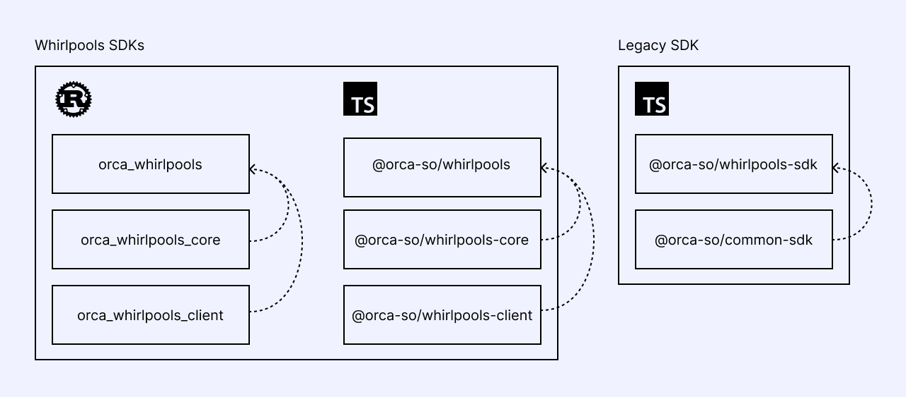

# Orca SDKs 개요



Orca는 Solana 및 Eclipse의 Whirlpool 프로그램과 상호작용할 때 다양한 수준의 개발 요구사항을 충족하는 여러 SDK를 제공합니다.
유동성을 관리하거나, 풀 인프라가 필요한 애플리케이션을 구축하거나, 프로그램과 상호작용하는 자동화 도구를 개발하는 등, Orca SDK는 저수준의 세밀한 제어부터 고수준의 추상화까지 폭넓은 기능을 다룹니다.

다음은 Orca SDK 제품군에 대한 개요로, SDK의 다양한 계층을 구분하고 각각의 목적과 상호 관계를 설명합니다.

# 고수준 SDKs (High-Level SDKs)

Whirlpool 프로그램의 통합을 원하는 모든 사용자에게 가장 우선적으로 추천되는 SDK입니다.
이 SDK들은 틱 배열(tick array) 관리와 같은 복잡한 저수준 로직을 추상화하여, 풀과 포지션 관리, 스왑 실행을 훨씬 간단하게 만들어줍니다.
효율적이고 높은 수준의 기능을 필요로 하며 수동 설정과 관리를 최소화하고자 하는 개발자에게 적합합니다.

* **Rust**: [orca_whirlpools](https://crates.io/crates/orca_whirlpools)
  * Solana SDK 버전 `^1.18.0` 이상, `<3.0.0` 미만과 호환됩니다.
  * 기본적으로 Cargo는 최신 버전인 Solana SDK v2를 설치합니다. 이전 버전을 사용하는 경우 종속성 문제가 발생할 수 있습니다. 이를 해결하려면 다음 명령어로 lockfile 패치를 적용하세요.
```shell
cargo update solana-program:<현재버전> --precise <필요한버전>
```

또한 다음 패키지들에 대해서도 lockfile 패치를 적용해야 할 수 있습니다 : `solana-program`, `solana-client`, `solana-account-decorder`, `spl-token`, `spl-memo`, `spl-token-2022`, `spl-associated-token-account`

* **TypeScript Kit**: [@orca-so/whirlpools](https://www.npmjs.com/package/@orca-so/whirlpools)
  * Solana Kit과 호환됩니다.

* **TypeScript Legacy**: [@orca-so/whirlpools-sdk](https://www.npmjs.com/package/@orca-so/whirlpools-sdk)
  * Solana Web3.js와 호환됩니다.
  * "Legacy"라는 명칭에도 불구하고, 이 클래스 기반 SDK는 여전히 Solana Web3.js를 사용하는 프로젝트와의 통합을 위한 안정적인 선택지입니다. Orca의 Whirlpool 프로그램과 상호작용하기 위한 기본적인 도구를 제공하며, `@orca-so/common-sdk`의 유틸리티를 포함합니다.

## 2. 코어 SDK

**코어 SDK**는 유동성 풀과 작업할 때 필수적인 수학 연산 및 견적(Quote) 관련 유틸리티를 제공합니다.
이 라이브러리들은 포지션 상태 확인, 가격 변환, 유동성 조정 및 스왑에 대한 견적 계산과 같은 작업에 중점을 두고 있습니다.
Core SDK는 Rust로 작성되었지만, TypeScript 프로젝트에 손쉽게 통합할 수 있도록 WebAssembly(Wasm)으로 컴파일되어 제공됩니다.

* **Rust**: [orca_whirlpools_core](https://crates.io/crates/orca_whirlpools_core)
* **TypeScript Kit**: [@orca-so/whirlpools-core](https://www.npmjs.com/package/@orca-so/whirlpools-core)
* **TypeScript Legacy**: [@orca-so/whirlpools-sdk](https://www.npmjs.com/package/@orca-so/whirlpools-sdk)
  * Legacy SDK는 특정 수학 연산을 위해 별도의 유틸리티 클래스를 제공합니다. 예를 들어, `PoolUtil`, `TickUtil`, `TickArrayUtil`, `SwapUtils` 등이 있습니다. 또한 견적(Quotes)를 위한 별도의 함수들이 제공되며, `decreaseLiquidityQuoteByLiquidity`, `increaseLiquidityQuoteByInputToken`, `swapQuoteByInputToken`, `collectFeesQuote`, `collectRewardsQuote` 등을 포함합니다.

## 3. 저수준 SDK

이 SDK는 프로그램과 직접 상호작용하는 기능을 제공하며, Whirlpool 작업에 대한 완전한 저수준의 세밀한 제어가 필요한 개발자를 위해 설계되었습니다.
SDK를 통해 Solana 계정, 명령어 및 트랜잭션에 직접 접근할 수 있습니다.

* **Rust**: [orca_whirlpools_client](https://crates.io/crates/orca_whirlpools_client)
  * Anchor 버전 `^0.26` 이면서 `<0.30` 미만과 호환됩니다. 만약 프로젝트에서 Anchor 버전 `^0.30` 이상을 사용하는 상태에서 `Cargo.toml` 에서 `orca_whirlpools_client`의 Anchor 기능을 활성화한 경우, 다음과 같은 Lockfile 패치를 적용하여 더 낮은 버전으로 전환해야 할 수도 있습니다.
```shell
cargo update anchor-lang:<현재버전> --precise <필요한버전>
```

  * `solana-program` 버전은 `^1.18.0` 이상이면서 `<3.0.0` 미만과 호환됩니다. 기본적으로 Cargo는 Solana SDK의 최신 버전(`^v2`)을 설치합니다. 이로 인해 이전 버전을 사용하는 경우 종속성 문제가 발생할 수 있습니다. 이 문제를 해결하려면 다음 명령어를 사용하여 Lockfile 패치를 적용할 수 있습니다.
```shell
cargo update solana-program:<현재버전> --precise <필요한버전>
```

  * 주의: Anchor와 solana-progrma 모두의 호환성 문제를 해결하려는 경우, 패치를 적용하는 순서가 중요합니다. 반드시 **Anchor를 먼저 패치한 후**, 그 다음 **solana-progrma을 패치**하세요.

  * TypeScript Kit: [@orca-so/whirlpools-client](https://www.npmjs.com/package/@orca-so/whirlpools-client)
    * Solana Kit과 호환됩니다.

  * TypeScript Legacy: [@orca-so/whirlpools-sdk](https://www.npmjs.com/package/@orca-so/whirlpools-sdk)
    * Legacy SDK는 Whirlpool 프로그램의 명령어와 직접 상호작용할 수 있도록 도와주는 `WhirlpoolIx` 클래스를 제공합니다.